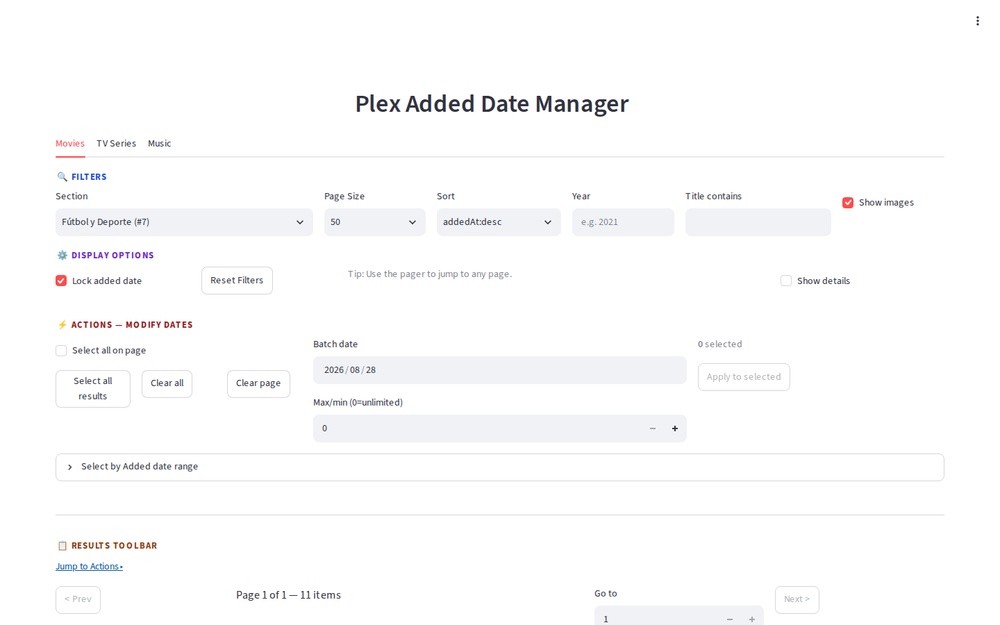
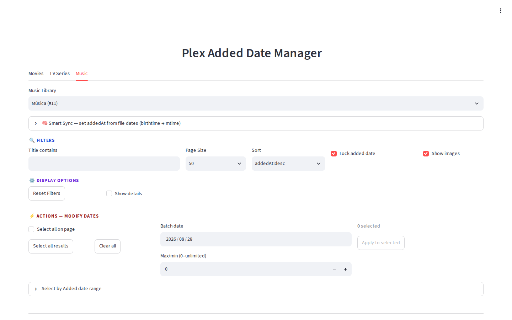
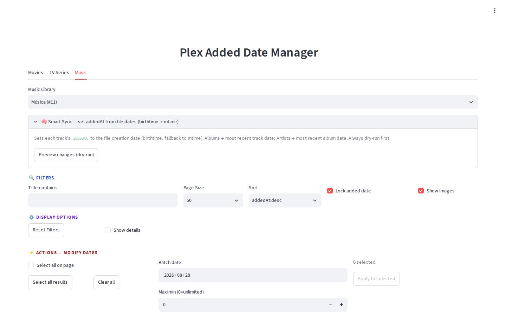
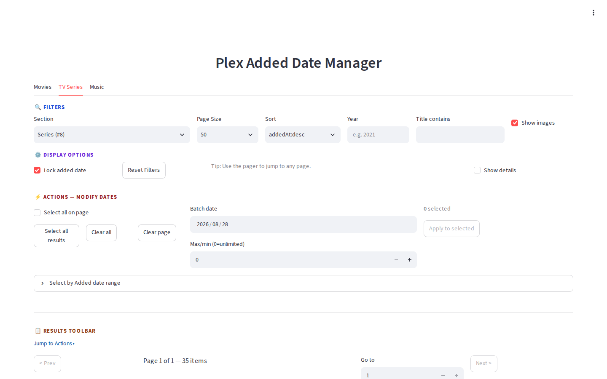

# Plex Added Date Manager

[](https://github.com/RicherTunes/plex-added-date-manager/actions/workflows/ci.yml)

Streamlit (Python) app that interacts with the Plex API to manage `addedAt` dates for **Movies, TV Shows, and Music (Artists, Albums, Tracks)** — with a clean 4-zone UI (Filters → Display → Results → Actions) and a **Smart Sync** that sets dates from file creation time.

## Screenshots

| Movies — Filters & Actions | Music — Artists |
|---|---|
|  |  |

| Music — Smart Sync | TV Series |
|---|---|
|  |  |

> Screenshots are full-page captures from `http://192.168.1.153:8501` (Streamlit `layout="wide"`).

## Setup

1. **Clone the repository**
2. **Create a virtual environment:**
   ```bash
   python -m venv venv
   source venv/bin/activate  # On Windows: venv\Scripts\activate
   ```
3. **Install dependencies:**
   ```bash
   pip install -r requirements.txt
   ```
4. **Configure Plex credentials:** Create a `.env` file at project root
   ```ini
   PLEX_TOKEN=your_plex_token_here
   PLEX_BASE_URL=http://your-plex-ip:32400
   ```

## Usage

```bash
streamlit run src/app.py
```

Open `http://localhost:8501` in your browser.

### What you can do

- **Movies & TV Shows**: Browse libraries, filter, sort, edit dates individually or in batch. TV preserves the compound action (season metadata + all child episodes).
- **Music**: Browse **Artists → Albums → Tracks** with breadcrumbs (`← Artist Name`). Same filters/sorts as Movies, plus hierarchical navigation.
- **Batch updates**: Select across pages (checkboxes), pick a date, apply with progress and rate-limiting.
- **Date range selection**: Presets (Last 7/30/90/365, This Year, Older >1y) + custom From/To → Select/Deselect range.
- **Per-item auto-save**: Change a date via the inline `Added` picker and it saves immediately (`addedAt.locked=1` if Lock is on).
- **Smart Sync (Music)**: Sets each track's `addedAt` to the file's **birthtime** (fallback `mtime`). Albums → most recent track date; Artists → most recent album date. Always **dry-run (Preview)** first, then Apply.

### UI layout — 4 zones

Every tab (Movies, TV, Artists, Albums, Tracks) shares the same visual structure:

| Zone | Color | Contains |
|---|---|---|
| **🔍 Filters** | blue | Section, Page Size, Sort, Year (server-side), Title contains |
| **⚙️ Display Options** | purple | Show images, Show details, Lock added date |
| **📋 Results Toolbar** | amber | Pagination (Prev/Next, Go to page), **N selected**, **Jump to Actions ▸** |
| **⚡ Actions** | red | Selection (Select page / Select all results / Clear), Batch date, Max/min, **Apply to N selected**, Date range presets, **Smart Sync** (Music only) |

`Jump to Actions ▸` in the toolbar scrolls smoothly to `⚡ Actions` (`id="actions-panel"`) so controls are always reachable on long lists.

### Batch operations

1. Check items or use **Select all on page** / **Select all results** (or **Select by Added date range**)
2. Pick **Batch date**
3. Optional **Max/min** rate limit
4. **Apply to selected** → progress bar + retry with backoff

### Smart Sync — Music dates from files

In the **Music** tab, after picking a library (e.g., `Música (#11)`):

1. Open `🧠 Smart Sync — set addedAt from file dates (birthtime → mtime)` (collapsed by default)
2. **Preview changes (dry-run)** → scans all tracks (`/library/sections/{id}/all?type=10`), reads `Media.Part.file`, stats each file (`st_birthtime` → `st_mtime`), builds plan for tracks/albums/artists, shows `X tracks, Y albums, Z artists` + sample 50 rows
3. Set **Max/min** if needed, then **Apply changes** → updates Plex via `PUT /library/sections/{id}/all` with `addedAt.value` + `addedAt.locked`

> Tip: The scan is synchronous with a progress bar (`fetching_tracks`, `reading_files`). For 4–5k tracks expect ~5–15s on local disk; slower on network mounts.

## CLI Batch Mode

```bash
# Movies: dry run
python src/cli.py --section-id 1 --type movie --year 2023 --date 2024-01-15 --dry-run

# Apply with throttle
python src/cli.py --section-id 1 --type movie --year 2023 --date 2024-01-15 --sleep 0.1

# Rate limit 120/min
python src/cli.py --section-id 1 --type movie --year 2023 --date 2024-01-15 --max-per-minute 120

# Filter by title / specific IDs
python src/cli.py --section-id 1 --type movie --title-contains batman --date 2022-10-01
python src/cli.py --section-id 1 --type movie --ids 12345 67890 --date 2021-06-01

# Music
python src/cli.py --section-id 11 --type track --date 2024-01-15
python src/cli.py --list-sections --sections-type artist

# Smart Sync — music dates from files (dry-run first, then apply)
python src/cli.py --section-id 11 --sync-from-files --dry-run
python src/cli.py --section-id 11 --sync-from-files --max-per-minute 60
```

### CLI flags

| Flag | Description |
|------|-------------|
| `--section-id` | Plex section ID (required). Movies often `1`/`5`, Shows `2`/`8`, Music `11`. |
| `--type` | `movie`/`1`, `show`/`2`, `artist`/`8`, `album`/`9`, `track`/`10` |
| `--date` | New date `YYYY-MM-DD` (required unless `--sync-from-files` or `--list-sections`) |
| `--year` | Filter by year (server-side) |
| `--title-contains` | Filter by title (client-side) |
| `--ids` | Only these ratingKeys |
| `--page-size` | Fetch page size (default 200) |
| `--max-items` | Stop after N updates |
| `--sleep` | Seconds between updates |
| `--max-per-minute` | Rate limit |
| `--no-lock` | Do not lock `addedAt` after update |
| `--dry-run` | Show planned changes only |
| `--sync-from-files` | **Music only:** set `addedAt` from file birthtime/mtime (dry-run first) |
| `--base-url` / `--token` | Override `PLEX_BASE_URL` / `PLEX_TOKEN` |
| `--list-sections` | Print key, type, title for all libraries |
| `--sections-type` | Filter list by type |

Retries failed updates 3× with exponential backoff; respects `Retry` on 429/5xx.

## Known Limitations

- Rendering hundreds of image widgets per page is heavy. Use 50–100 per page and toggle images for large libraries.
- Lists are paginated, not virtualized.
- Music: Year filter not available for Artists (no year field).
- Batch/Sync sends one `PUT` per item. For very large batches use CLI with rate limiting.
- `birthtime` availability depends on filesystem/OS; fallback is `mtime`.

## License

MIT
